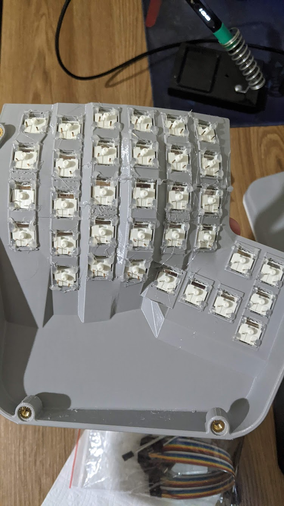
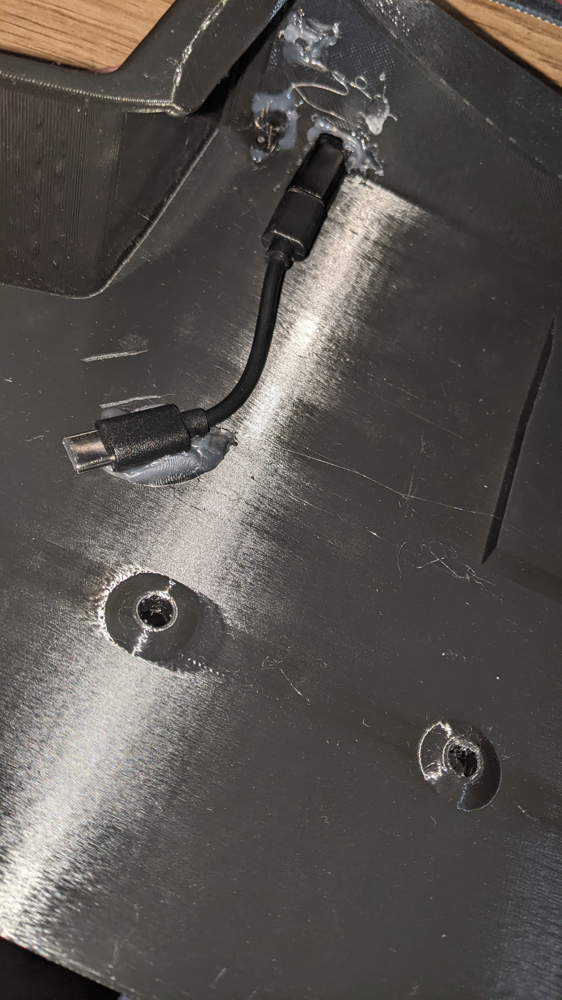
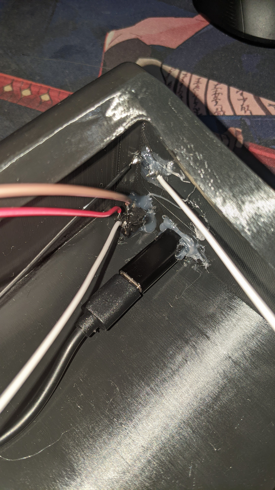
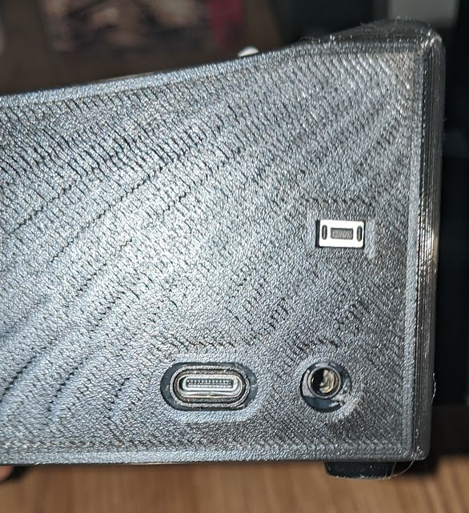
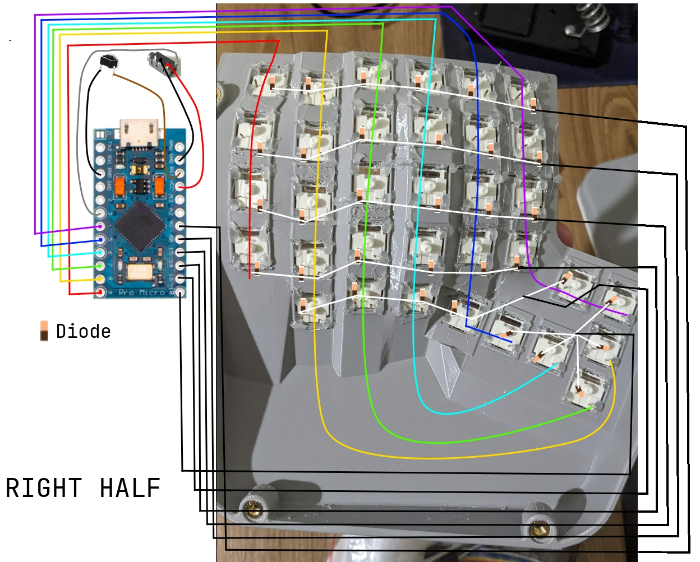
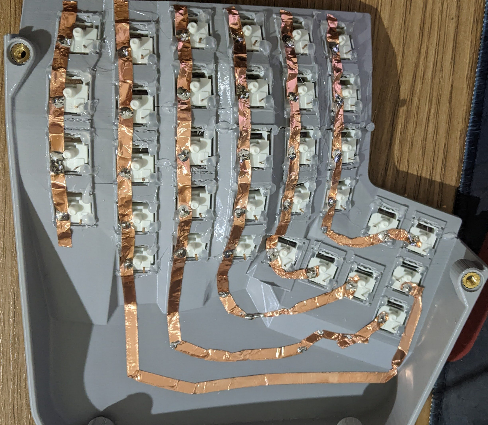
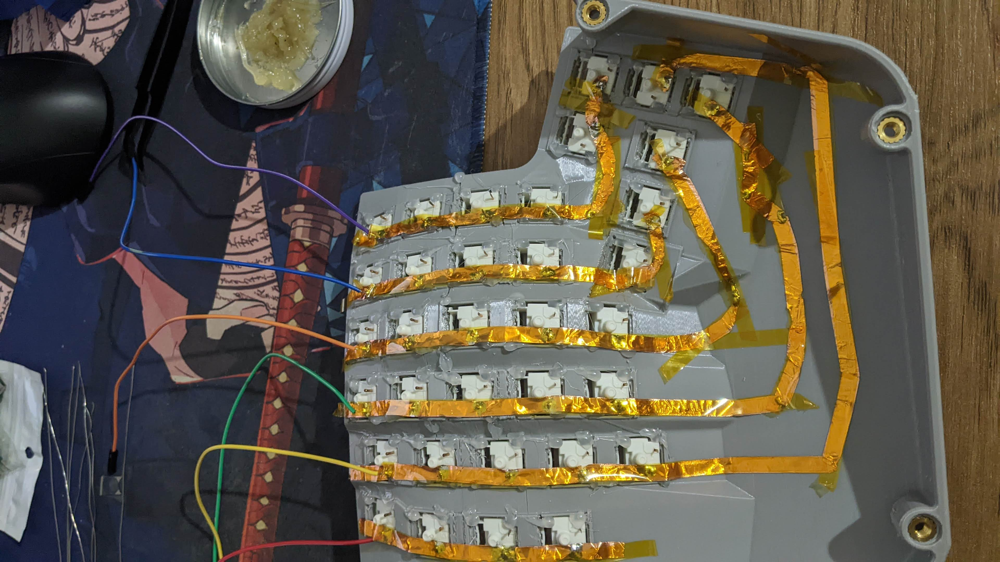
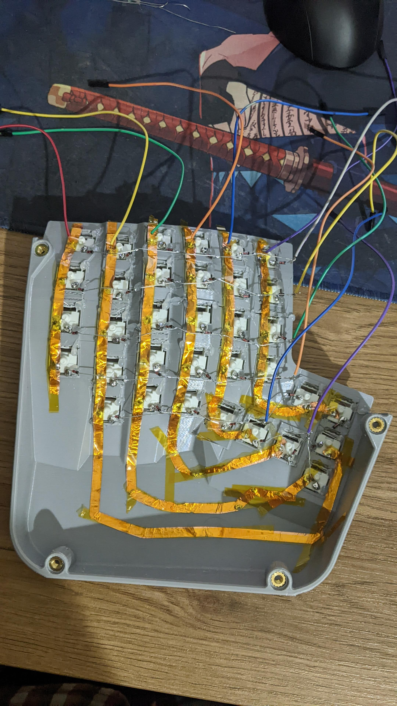
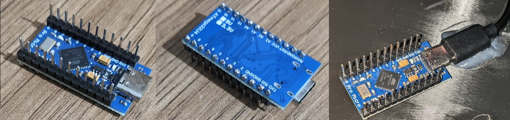
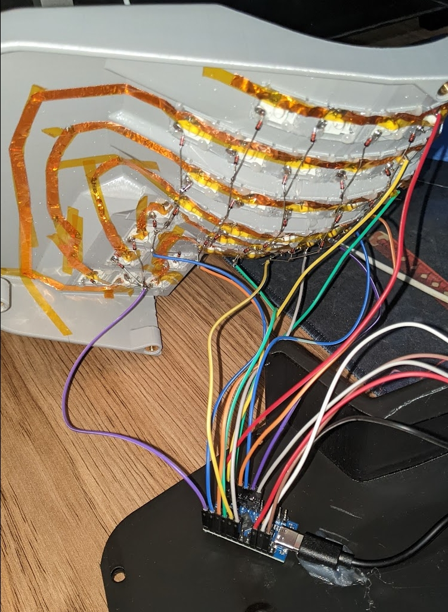

# Ergo-V-1 Split Keyboard

Ergo-V-1 is an open-source [QMK](https://qmk.fm/) powered, wired, ergonomic, split mechanical keyboard. 
This repository aims to answer these three questions
 * Why? is this keyboard even a thing
 * What? parts do you need to build your own Ergo-V-1
 * How? to build one and flash a firmware

This keyboard is derived from [Ergo-S-1](https://github.com/wizarddata/Ergo-S-1) which means f3d file was originally made by its author

## Why?
Original [Ergo-S-1](https://github.com/wizarddata/Ergo-S-1) gives ability to try out closest thing to Kinesis Advantage 2 with DIY capability, which is great. But it has three flaws for my taste. This project aims to fix these three flaws of original Ergo-S-1
 * Modified thumb cluster with one additional key
   * I’m not a fan of the original Maltron-style thumb cluster and prefer the Corne-style three-key layout.  
     With this modification, you can use the keyboard either like a standard Kinesis Advantage 2 or with a thumb-cluster experience similar to a Corne.  
    I personally use the latter, as it makes key combinations involving the pinky and thumb more comfortable.
 * Improved switch cutouts, now compatible with Kailh-style switches  
   * Previously, switches would get permanently stuck in the base once inserted, making prototyping difficult.  
    With the updated cutouts, switches can be removed normally, and the design now supports Kailh-style switches as well.
 * Unlike Ergo-S-1 this is a wired keyboard based on QMK
   * DIY wireless keyboards come with their own set of hassles (such as Bluetooth quirks, battery management) so I chose wired design instead.

## What?
#### Case
Stl files are included in this repository. 
0.4mm nozzle and PLA filament worked fine 
> If you don't have a 3d printer try using any 3D printing service in your area

There are also original ramp objects from Ergo-S-1 inside f3d file. You also can print and use them if you wish to

#### BOM
| Qty |Item                                      |Notes                                              |
|----:|------------------------------------------|---------------------------------------------------|
|  68 |Cherry or Kailh switches                  |                                                   |
|   2 |Arduino Pro Micros                        |Ordered them from Aliexpress                       |
|  68 |1N4148 Diodes                             |                                                   |
|  12 |M4 Bolts                                  |Used 12mm tall hex sockets                         |
|  12 |M4 Heat Set Inserts                       |Used 4x5x7 sized ones                              |
|  68 |Cherry style Keycaps                      |Any keycap profile is compatible as far as I tested|
|  10 |Silicone adhesive feet                    |Height at least 3mm                                |
|     |Insulated Wires                           |There are various kind of wires for this, build shown in picture will use jumper ribbon cables if you are used to building handwired keyboards just go with your way|
|   2 |TRRS jack                                 |I used PJ320a but any other one will do the job    |
|   2 |TRRS cable                                |TRS will also work since the firmware uses serial  |
|   2 |Momentary switch                          |Particular size 3x6x4.3mm(i.e. ones uesd on Corne PCBs)|
|   2 |USB-C Female to Female adapter            |This is used to connect Pro Micro to incoming PC usb cable|
|   2 |USB-C Male to Male short cable            |This is used to connect Pro Micro to Female To Female adapter|
|     |Conductive copper tape signle sided       |We will use this for columnar wiring. You can ignore this if you are doing handwiring with a traditional cables approach)
|     |High temperature resistant capton tape    |We will use this to insulate columnar copper tapes, ignore this if you did not use them|
|     |Hot Glue Gun                              |                                                   |
    
## How?
#### This sections walks through of build process step by step 
> This projects shares most of the building steps from original [Ergo-S-1](https://github.com/wizarddata/Ergo-S-1), therefore you might also find its build [guide](https://github.com/wizarddata/Ergo-S-1/blob/main/Ergo%20S-1%20OE%20Assembly%20Instructions.pdf) helpful  
> Just keep in mind that firmware(therefore keyboard matrix) is totally different and avoid repeating wrong parts from that guide

#### First steps
 * Install heat inserts into the bottom case
 * Install switches into the switch bases
 * Hot glue switches to be extra safe

 
Picture

 

#### Add ports to the case
 * Hot glue TRRS jack, reset switch and female to female adapter in their respective cutouts  
   > I suggest that, at first solder wires to the reset switch and TRRS jack and then hot glue them into their respective places, for the first half I did the opposite way and it was impractical  
   > Also keep in mind that you should use exact same solder pins on trrs jack for both halves
   

    
pictures

    

    
    

    finally front side of the case should look like this
    
   

#### Now its time to start soldering rows and columns matrix
  
  Before we start soldering, let's take a look at the matrix physical scheme
  
  
  This picture shows wiring schema for the right half.  
  For the left one you should just mirror literally everything and you are good to go

  * At first solder columns.
    > I used single sided conductive copper tape but of course traditional wires will do the job too
    

     
picture

    
     
    

  * Then solder their ends to the jumper wires which eventually will be soldered into the pro micro gpios  
    Also don't forget  to insulate each of them to avoid shorting with other components
     
  * Now we can solder diodes and complete row. Using only diode components is sufficient for this step  
    You need to solder single diode on each switch, make sure that anode side(ligh color) is soldered on one of the switches metal leg  
    and cathode side(black color) is accessible for another diode to get soldered on, this way you get some kind of chain made by the diodes attaching each other with cathode ends.  
    Also you need to keep in mind that direction of this chain is important and they should be going from left(pinky column) to the right(index finger column), i.e. from the red column to the purple as ilustrated in the [schema picture](#schm)
    * After finishing diodes on all rows you can solder jumper wires to each rows end(similarly to what we did on columns)  

Finished rows and columns should look like this

#### Flash pro micros and prepare for final gpio soldering

  At first you need to flash firmware on the pro micro(sometimes you might get faulty one unfortunately and its better to test it before actually solder it to any of the component)
  * To flash it plug it into the pc
  * Clone this git repo(its a fork of main QMK branch, temporarily only it will support this (new)keyboard before sending Pull Request to them and merging it)
  https://github.com/VPavliashvili/qmk_firmware/tree/add_ergo_v_1_keyboard  
  then locate to [Ergo-V-1 directory](https://github.com/VPavliashvili/qmk_firmware/blob/add_ergo_v_1_keyboard/keyboards/handwired/ergo_v_1/readme.md) and follow the given instructions(its very similar to dactyl-manuform flashing process)
  * Then run `lsusb` command and you should see something like this(if you are on windows/mac check the connected devices)
    > Bus 001 Device 031: ID feed:97c4 wizardkeyboards Ergo-V-1

Now as we made sure both pro micros are working we can solder its pins and attach to the usb cable inside the keyboard case. As shown in the picture below

Finally connect column and row wires to the pro micro pins as shown in the [schema](#schm)

 
You will end up with something like this

 

## License
All the license information can be seen on the original Ergo-S-1 repo page under [SOURCE](https://github.com/wizarddata/Ergo-S-1/tree/6bc2e609038da9b6365213c202cfba3e1e582553/SOURCE) directory 
Other stuff that I added by myself also falls under same licence

### Additional Attribution
Switch bases are taken from [Cygnus](https://github.com/juhakaup/keyboards) fusion files  

And of course big thanks to [wizardkeybords](https://github.com/wizarddata/), the original author of ERGO-S-1
